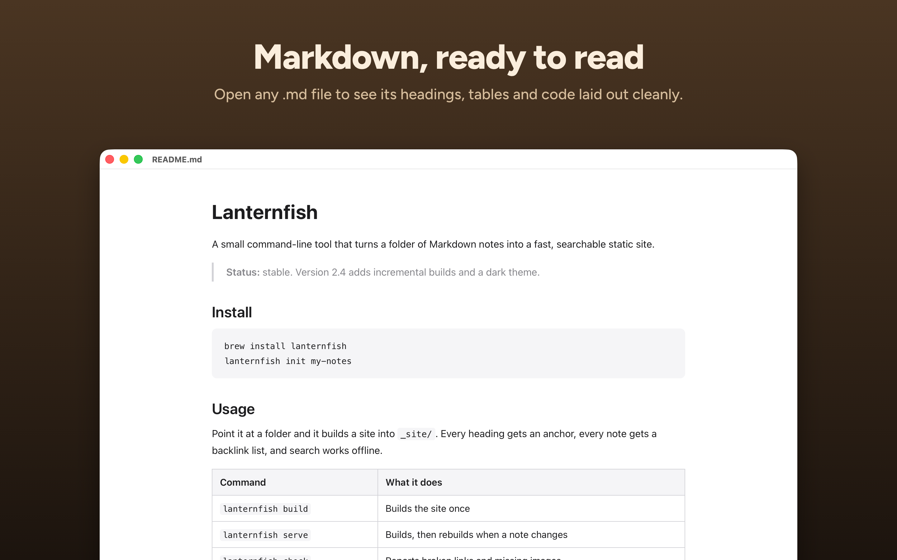

# MDView

A lightweight Markdown viewer for macOS. Opens `.md`, `.markdown`, and `.txt` files in a clean, readable window with no editing — just reading.



## Features

- Open files via File > Open, drag-and-drop, or double-click from Finder
- Quick Look: press Space on a `.md` file in Finder to see it rendered
- Live reload: the document updates when the file changes on disk
- Links to headings (`[Setup](#setup)`) work, using GitHub's anchor names
- Multiple windows (each file gets its own window)
- Find in document (Cmd+F)
- Print / Save as PDF (Cmd+P) on the paper size from Page Setup, breaking pages between lines
- File > Export as PDF with clickable links (web, email and links to headings)
- Recently Read file list
- Zoom in/out and content width adjustment
- Font selection: System Sans, System Serif, Georgia, Palatino, Charter
- Dark mode toggle
- Justified text option
- Renders tables, code blocks, headings, links, images, and other standard Markdown

## Install

Requires Swift 5.9+ and macOS 14+.

**Xcode** (the full app, including the Quick Look extension): open `MDView.xcodeproj` and run the MDView scheme.

**Quick install** (builds a universal binary with Swift Package Manager and copies it to `/Applications`, without the Quick Look extension):

```
./install.sh
```

Pass a folder to install somewhere else, e.g. `./install.sh ~/Applications`.

**Build from source** (debug, current architecture only):

```
swift build
.build/debug/mdview
```

## Keyboard Shortcuts

| Shortcut | Action |
|----------|--------|
| Cmd+O | Open file |
| Cmd+P | Print / Save as PDF |
| Shift+Cmd+P | Page Setup |
| Cmd+F | Find in document |
| Cmd+G | Find next |
| Shift+Cmd+G | Find previous |
| Cmd++ | Zoom in |
| Cmd+- | Zoom out |
| Cmd+0 | Actual size |
| Cmd+] | Wider |
| Cmd+[ | Narrower |
| Cmd+J | Toggle justify |
| Cmd+D | Toggle dark mode |

## Architecture

The app uses a hybrid SwiftUI + AppKit approach:

- **SwiftUI `App` struct** provides the menu bar and keyboard shortcuts
- **AppKit `NSWindow`s** are managed by the `AppDelegate` for document windows
- **`WKWebView`** renders Markdown converted to HTML via Apple's [swift-markdown](https://github.com/apple/swift-markdown) library
- Preferences (font, zoom, width, appearance, alignment) persist via `UserDefaults`
- `Sources/Shared` (Markdown conversion and the page template) is shared with the **Quick Look extension** in `QuickLook/`
- The app is sandboxed. Images next to a document load through a custom URL scheme, after a one-time permission per folder. The page itself allows no scripts (Content Security Policy), since documents can contain raw HTML

## License

[MIT](LICENSE)
